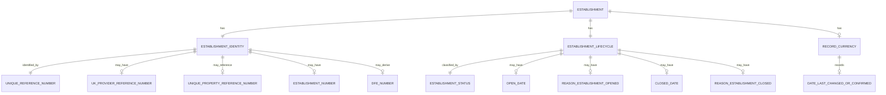
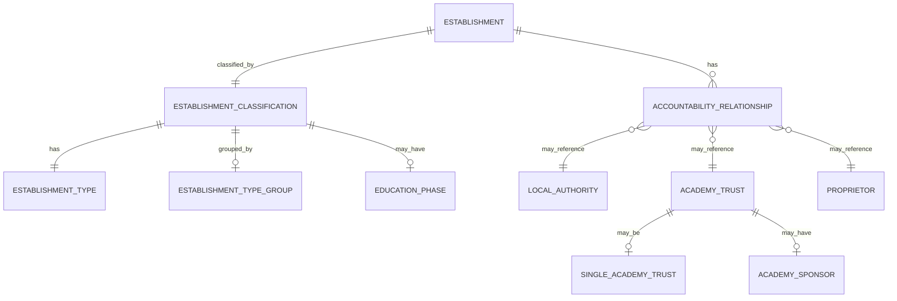

# Establishment Details Conceptual Model

## Purpose

This document describes the first conceptual model slice for the Education Provider Registry data prototype.

The slice covers the public GIAS Establishment `Details` view for the currently modelled establishment examples. It sits alongside:

- `establishment-details-vocabulary-skos.ttl`
- `establishment-details-taxonomy-skos.ttl`

The vocabulary defines the terms. The taxonomy defines the classification facets. This document describes the business concepts and relationships that those terms imply.

## Scope

This conceptual model is deliberately bounded. It covers the Establishment Details submodel only, not the whole GIAS domain.

The first iteration is based on the Establishment Details work for:

- Academy converter.
- Community school.
- Other independent school.

Later iterations can extend the model for governance, establishment links, groups, extracts, permissions, change workflow and wider provider types.

## Modelling Approach

The GIAS model is large, so conceptual modelling should be split by coherent submodel rather than forced into one diagram.

Each submodel should have one Markdown file. That file may contain several Mermaid diagrams if a single diagram becomes too busy. Diagrams should be split by business concern, not by legacy database table.

For this submodel, the diagrams are:

- Establishment Details overview.
- Identity, identifiers and lifecycle.
- Classification and accountability.
- Education provision, measures and public references.

The diagrams use business concepts. They do not define physical tables, columns, indexes or database types.

## Establishment Details Overview

This view shows the main business areas that make up the public Establishment Details record.

```mermaid
flowchart TD
    Establishment[Establishment]

    Establishment --> Identity[Establishment identity]
    Establishment --> Lifecycle[Establishment lifecycle]
    Establishment --> Classification[Establishment classification]
    Establishment --> Accountability[Accountability context]
    Establishment --> Location[Location and contact]
    Establishment --> Leadership[Leadership]
    Establishment --> EducationProvision[Education, admissions and provision]
    Establishment --> Measures[Capacity and pupil measures]
    Establishment --> Faith[Faith context]
    Establishment --> Sen[Sen and resourced provision]
    Establishment --> ExternalRefs[External references]
    Establishment --> RecordCurrency[Record currency and stewardship]
```

### Notes

- `Establishment` is the central concept in this slice.
- Some areas apply to all establishments; others are conditional on establishment type.
- This diagram is intentionally not a database model. It shows where concepts belong before deciding the logical schema.

## Identity, Identifiers And Lifecycle

This view separates stable establishment identity from lifecycle state and record currency.

### Notes

- `URN` is represented by the vocabulary concept `Unique Reference Number`.
- `UKPRN` is represented by `UK Provider Reference Number` and should be treated as an external identifier, not the sole establishment key.
- `DfE number` is derived from local-authority context plus establishment number. It should not be modelled as an unrelated identifier.
- `Date last changed or confirmed` describes GIAS record currency, not the lifecycle of the real-world establishment.

## Classification And Accountability

This view separates what an establishment is from who is accountable for it.

### Notes

- `Establishment type` is a classification, not the same thing as an accountable organisation.
- `Establishment type group` is a broad grouping of establishment types.
- Accountability differs by establishment family. A community school is maintained by a local authority. An academy converter is associated with an academy trust. An other independent school may be associated with a proprietor.
- These relationships should be refined as more establishment types are modelled.

## Education Provision, Measures And Public References

This view groups the remaining Establishment Details concepts into provision, measures and public/external references.

```mermaid
erDiagram
    ESTABLISHMENT ||--o| EDUCATION_ADMISSIONS_AND_PROVISION : may_have
    EDUCATION_ADMISSIONS_AND_PROVISION ||--o| STATUTORY_AGE_RANGE : may_have
    EDUCATION_ADMISSIONS_AND_PROVISION ||--o| GENDER_OF_ENTRY : may_have
    EDUCATION_ADMISSIONS_AND_PROVISION ||--o| ADMISSIONS_POLICY : may_have
    EDUCATION_ADMISSIONS_AND_PROVISION ||--o| BOARDING_PROVISION : may_have
    EDUCATION_ADMISSIONS_AND_PROVISION ||--o| NURSERY_PROVISION : may_have
    EDUCATION_ADMISSIONS_AND_PROVISION ||--o| SIXTH_FORM_PROVISION : may_have
    EDUCATION_ADMISSIONS_AND_PROVISION ||--o| SPECIAL_CLASS_PROVISION : may_have

    ESTABLISHMENT ||--o| CAPACITY_AND_PUPIL_MEASURES : may_have
    CAPACITY_AND_PUPIL_MEASURES ||--o| SCHOOL_CAPACITY : may_have
    CAPACITY_AND_PUPIL_MEASURES ||--o| PUPIL_COUNT : may_have
    CAPACITY_AND_PUPIL_MEASURES ||--o| FREE_SCHOOL_MEAL_MEASURE : may_have

    ESTABLISHMENT ||--o| FAITH_CONTEXT : may_have
    FAITH_CONTEXT ||--o| RELIGIOUS_CHARACTER : may_have
    FAITH_CONTEXT ||--o| RELIGIOUS_ETHOS : may_have
    FAITH_CONTEXT ||--o| DIOCESE : may_have

    ESTABLISHMENT ||--o| SEN_AND_RESOURCED_PROVISION : may_have
    SEN_AND_RESOURCED_PROVISION ||--o| TYPE_OF_SEN_PROVISION : may_have
    SEN_AND_RESOURCED_PROVISION ||--o| TYPE_OF_RESOURCED_PROVISION : may_have
    SEN_AND_RESOURCED_PROVISION ||--o| RESOURCED_PROVISION_MEASURE : may_have
    SEN_AND_RESOURCED_PROVISION ||--o| SEN_UNIT_MEASURE : may_have

    ESTABLISHMENT ||--o{ EXTERNAL_REFERENCE : may_have
    EXTERNAL_REFERENCE }o--|| INSPECTION_REPORT_REFERENCE : may_reference
    EXTERNAL_REFERENCE }o--|| EXTERNAL_SERVICE_REFERENCE : may_reference
```

### Notes

- Provision concepts are partly classification and partly capability. Later logical modelling will need to decide which values are reference data and which are structured facts.
- Measures need careful treatment because they often have a date, source and interpretation. A number alone is rarely enough.
- External references point to other services or publications. They should not be mistaken for data owned by the registry.

## Open Questions

| Question | Why It Matters |
| --- | --- |
| Should `UPRN` be part of establishment identity, location, or both? | It identifies an addressable property, not the establishment as a legal or operational entity. |
| Should `DfE number` be physically stored, derived, or exposed only as a presentation value? | The current system derives it from local-authority and establishment number context. |
| Which accountability relationships are mandatory by establishment type? | This affects both the logical model and validation rules. |
| Which measures need source dates and provenance? | Capacity, pupil count and free-school-meal measures may be time-bound. |
| Which external references are registry-owned links versus externally owned facts? | This affects ownership, freshness and API design. |

